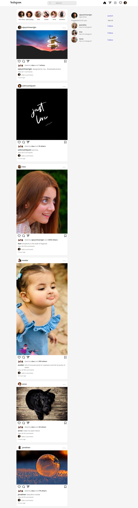
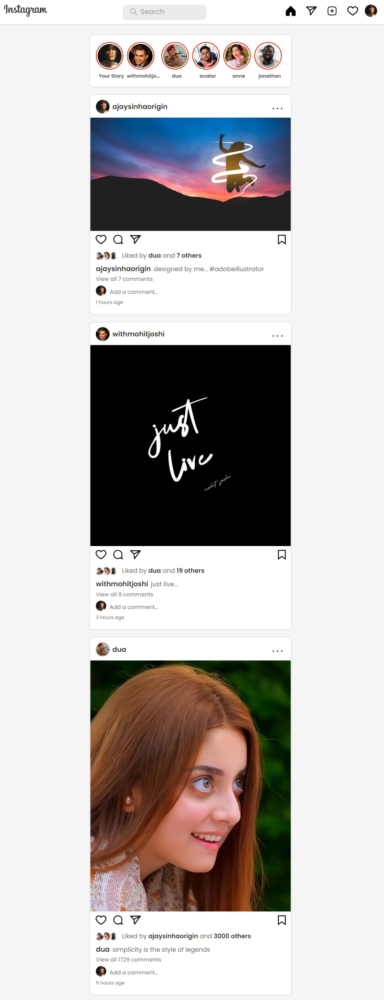
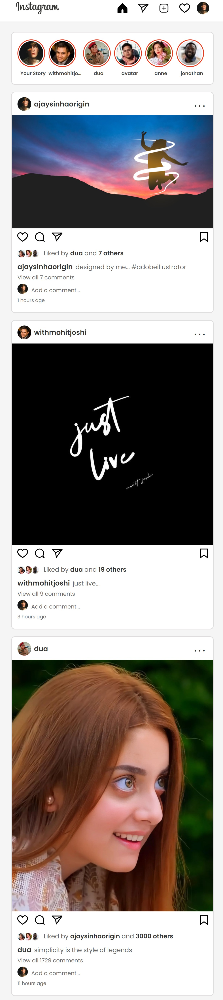

# instagram-clone

It is a clone of instagram in which you will see the layout just like instagram.There is some Posts ,Stories and a header tab.By developing this i polished my UI designing skill.

## Table of contents

- [Designs](#designs)
- [Link](#links)
- [Built With](#built-with)
- [What I learned](#what-i-learned)
- [Author](#author)

### Links

- Live Site URL : [instagram-clone](https://ajaysinhaorigin.github.io/instagram-clone/)

### Designs

  

### Built with

- React JS
- CSS3 custom properties  
- Grid & Flex
- Semantic HTML5 markup

### What I learned

- ReactJS Practice
- UI design
- CSS Media Quary

### Author

- Frontend Mentor  - [@ajaysinhaorigin](https://www.frontendmentor.io/profile/ajaysinhaorigin)  
- Linked in - [@ajaysinhaorigin](https://www.linkedin.com/in/ajaysinhaorigin/)
